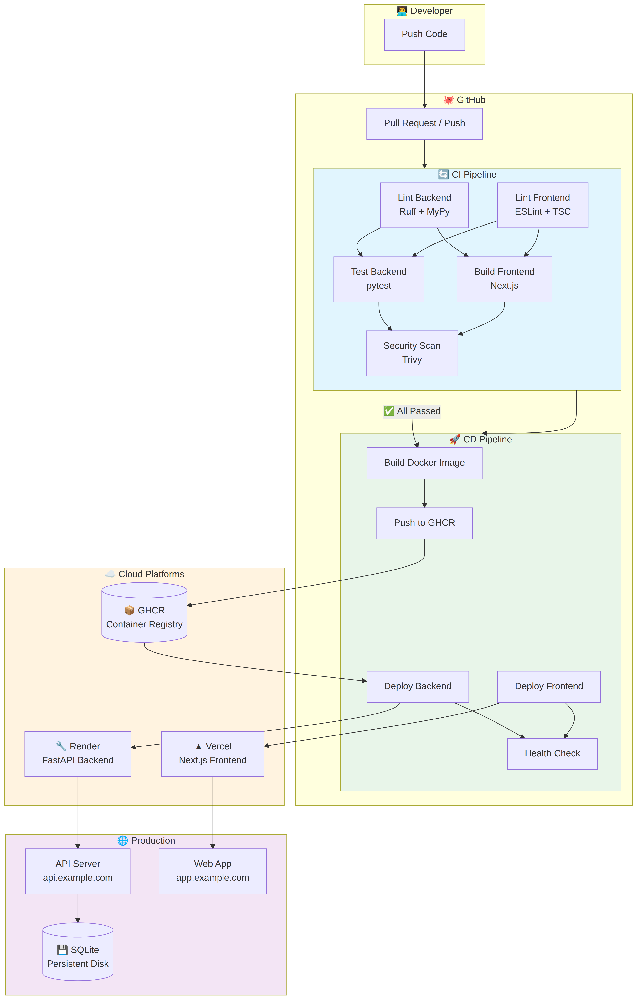

# CI/CD Deployment Guide

This document provides comprehensive instructions for setting up CI/CD pipelines for the Auto-Gen-Test-Exam project.

## Overview

The project uses **GitHub Actions** for CI/CD with the following deployment targets:

| Component          | Platform | Tier     | Region    |
| ------------------ | -------- | -------- | --------- |
| Backend (FastAPI)  | Render   | Free     | Singapore |
| Frontend (Next.js) | Vercel   | Hobby    | Singapore |
| Database           | SQLite   | Embedded | -         |

## Architecture



### Flow Overview

| Trigger           | Pipeline | Action                         |
| ----------------- | -------- | ------------------------------ |
| Push to `develop` | CI → CD  | Deploy to **Staging**          |
| Push to `main`    | CI → CD  | Deploy to **Production**       |
| Pull Request      | CI Only  | Validate code quality          |
| Manual Dispatch   | CD       | Deploy to selected environment |

## Setup Instructions

### 1. GitHub Repository Secrets

Navigate to `Settings → Secrets and variables → Actions` and add:

#### Required Secrets

| Secret Name                  | Description                  | How to Get                                                    |
| ---------------------------- | ---------------------------- | ------------------------------------------------------------- |
| `VERCEL_TOKEN`               | Vercel API token             | [Vercel Settings → Tokens](https://vercel.com/account/tokens) |
| `VERCEL_ORG_ID`              | Vercel organization ID       | `vercel link` then check `.vercel/project.json`               |
| `VERCEL_PROJECT_ID`          | Vercel project ID            | Same as above                                                 |
| `RENDER_DEPLOY_HOOK_STAGING` | Render deploy webhook        | Render Dashboard → Service → Settings → Deploy Hooks          |
| `RENDER_DEPLOY_HOOK_PROD`    | Render deploy webhook (prod) | Same as above for production service                          |

#### Optional Secrets

| Secret Name           | Description                              |
| --------------------- | ---------------------------------------- |
| `BACKEND_URL_STAGING` | Staging backend URL for health checks    |
| `BACKEND_URL_PROD`    | Production backend URL for health checks |

### 2. Vercel Setup

1. **Install Vercel CLI**

   ```bash
   pnpm add -g vercel
   ```

2. **Link Project**

   ```bash
   cd frontend
   vercel link
   ```

3. **Configure Environment Variables** in Vercel Dashboard:
   - `NEXT_PUBLIC_API_URL` - Backend API URL
   - `NEXT_PUBLIC_WS_URL` - WebSocket URL

### 3. Render Setup

1. **Create New Web Service**
   - Connect GitHub repository
   - Select `backend` directory as root
   - Use Docker runtime

2. **Configure Environment Variables**:

   ```
   DATABASE_URL=sqlite+aiosqlite:///./data/app.db
   JWT_SECRET=<auto-generated>
   GEMINI_API_KEY=<your-key>
   CORS_ORIGINS=["https://your-frontend.vercel.app"]
   ```

3. **Add Persistent Disk** (for SQLite):
   - Mount Path: `/app/data`
   - Size: 1 GB

4. **Create Deploy Hook**:
   - Go to Settings → Deploy Hooks
   - Create hook and save URL as GitHub secret

### 4. GitHub Environments (Optional)

Create environments for better deployment control:

1. Go to `Settings → Environments`
2. Create `staging` and `production` environments
3. Add protection rules for production:
   - Required reviewers
   - Wait timer
   - Deployment branches

## Pipeline Workflows

### CI Pipeline (`.github/workflows/ci.yml`)

Runs on every push and PR:

1. **Backend**
   - Lint with Ruff
   - Type check with MyPy
   - Run pytest

2. **Frontend**
   - ESLint
   - TypeScript check
   - Build verification

3. **Security**
   - Trivy vulnerability scan

### CD Pipeline (`.github/workflows/cd.yml`)

Runs on push to `main` or `develop`:

1. Detect changed components
2. Build Docker image (if backend changed)
3. Deploy to Render
4. Deploy to Vercel
5. Health check

## Local Development with Docker

```bash
# Start all services
docker compose up -d

# View logs
docker compose logs -f

# Stop services
docker compose down

# Rebuild
docker compose up -d --build
```

## Monitoring & Debugging

### Check Deployment Status

```bash
# Check workflow runs
gh run list

# View specific run
gh run view <run-id>

# Tail logs
gh run watch
```

### Render Logs

```bash
# Install Render CLI
brew install render-oss/render/render-cli

# Login
render login

# Tail logs
render logs <service-name>
```

### Vercel Logs

```bash
# View deployment logs
vercel logs <deployment-url>

# Live function logs
vercel logs --follow
```

## Rollback Procedures

### Vercel Rollback

1. Go to Vercel Dashboard → Deployments
2. Find previous working deployment
3. Click "..." → "Promote to Production"

### Render Rollback

1. Go to Render Dashboard → Events
2. Find previous deploy
3. Click "Rollback"

## Cost Estimation (Free Tier)

| Service        | Free Tier Limits                             |
| -------------- | -------------------------------------------- |
| Vercel Hobby   | 100GB bandwidth, 100 deployments             |
| Render Free    | 750 hours/month, sleeps after 15min inactive |
| GitHub Actions | 2000 minutes/month (public repos unlimited)  |

## Best Practices

1. **Branch Protection**
   - Require PR reviews for `main`
   - Require status checks to pass

2. **Semantic Versioning**
   - Use conventional commits
   - Tag releases properly

3. **Security**
   - Never commit secrets
   - Rotate secrets regularly
   - Use environment-specific configs

4. **Performance**
   - Use caching in CI
   - Optimize Docker layers
   - Enable Turbopack for Next.js
