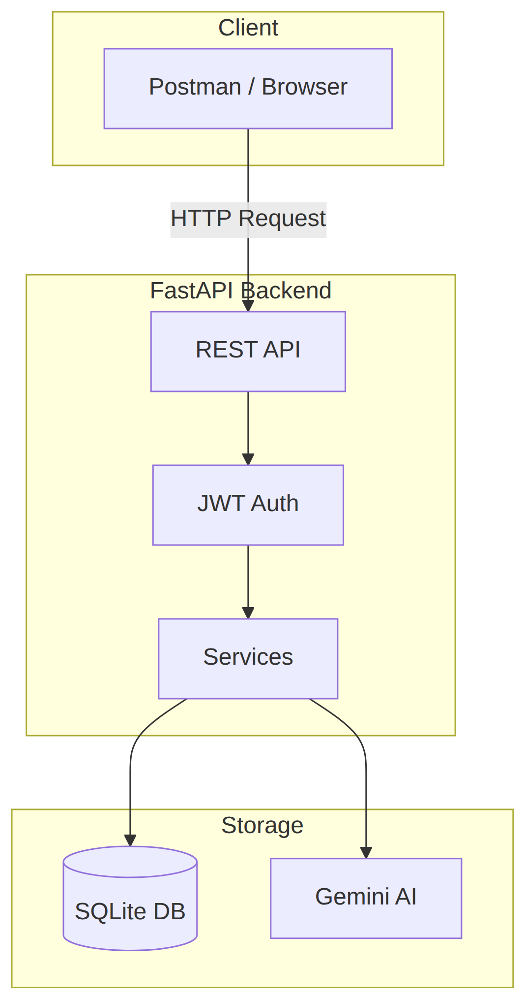

# Hướng Dẫn Manual API Testing với Postman

> **Tài liệu dành cho:** Thực tập sinh (Intern) – Dự án "Hệ Thống Thi CNTT Online"
>
> **Base URL:** `https://api.webtoonnkt.click`

---

## Mục Lục

1. [Tổng Quan Hệ Thống](#1-tổng-quan-hệ-thống)
2. [Chuẩn Bị Postman](#2-chuẩn-bị-postman)
3. [Các Nhóm API](#3-các-nhóm-api)
   - [3.1 Health Check](#31-health-check)
   - [3.2 Authentication](#32-authentication)
   - [3.3 Exams (Admin)](#33-exams-admin)
   - [3.4 Attempts (User)](#34-attempts-user)
   - [3.5 Admin Dashboard](#35-admin-dashboard)
4. [Bài Tập Thực Hành](#4-bài-tập-thực-hành)
5. [Phụ Lục: Status Code](#5-phụ-lục-status-code)

---

## 1. Tổng Quan Hệ Thống

### Kiến trúc



### Vai trò người dùng

| Vai trò   | Quyền hạn                                            |
| --------- | ---------------------------------------------------- |
| **Admin** | Tạo/sửa/xóa đề thi, xem tất cả kết quả, quản lý user |
| **User**  | Làm bài thi, xem kết quả của mình                    |

---

## 2. Chuẩn Bị Postman

### Bước 1: Tạo Environment

1. Mở Postman → Environments → Create Environment
2. Đặt tên: `Exam AI - Dev`
3. Thêm các biến:

| Variable       | Initial Value                  | Current Value         |
| -------------- | ------------------------------ | --------------------- |
| `base_url`     | `https://api.webtoonnkt.click` | (giống initial)       |
| `access_token` | (để trống)                     | (sẽ tự động cập nhật) |

### Bước 2: Tạo Collection

1. Collections → Create Collection → Đặt tên: `Exam AI APIs`
2. Tạo các folder con:
   - `Auth`
   - `Exams`
   - `Attempts`
   - `Admin`

### Bước 3: Thiết lập Authorization mặc định

1. Click vào Collection `Exam AI APIs` → Tab **Authorization**
2. Type: `Bearer Token`
3. Token: `{{access_token}}`

> Từ giờ mọi request trong collection sẽ tự động dùng token này.

---

## 3. Các Nhóm API

### 3.1 Health Check

#### `GET /api/health`

Kiểm tra server có đang hoạt động không.

**Request:**

```
GET {{base_url}}/api/health
```

**Expected Response (200 OK):**

```json
{
  "status": "ok"
}
```

---

### 3.2 Authentication

#### 3.2.1 Đăng ký – `POST /api/auth/register`

**Request Body:**

```json
{
  "email": "intern@example.com",
  "password": "Password123",
  "name": "Intern Tester"
}
```

**Test Scenarios:**

| #   | Kịch bản              | Expected                                    |
| --- | --------------------- | ------------------------------------------- |
| 1   | Data hợp lệ           | `201 Created` + user info                   |
| 2   | Email đã tồn tại      | `400 Bad Request` + "Email đã được sử dụng" |
| 3   | Password yếu (chỉ số) | `422 Unprocessable Entity`                  |

---

#### 3.2.2 Đăng nhập – `POST /api/auth/login`

**Request Body:**

```json
{
  "email": "intern@example.com",
  "password": "Password123"
}
```

**Expected Response (200 OK):**

```json
{
  "access_token": "eyJhbGciOiJIUzI1NiIs...",
  "token_type": "bearer",
  "user": {
    "id": 1,
    "email": "intern@example.com",
    "name": "Intern Tester",
    "role": "user"
  }
}
```

**Lưu Token tự động (Postman Script):**

Vào tab **Tests** của request, thêm:

```javascript
if (pm.response.code === 200) {
  var jsonData = pm.response.json();
  pm.environment.set("access_token", jsonData.access_token);
}
```

**Test Scenarios:**

| #   | Kịch bản            | Expected           |
| --- | ------------------- | ------------------ |
| 1   | Đúng email/password | `200 OK` + token   |
| 2   | Sai password        | `401 Unauthorized` |
| 3   | Email không tồn tại | `401 Unauthorized` |

---

#### 3.2.3 Lấy thông tin – `GET /api/auth/me`

**Headers:**

```
Authorization: Bearer {{access_token}}
```

**Expected Response (200 OK):**

```json
{
  "id": 1,
  "email": "intern@example.com",
  "name": "Intern Tester",
  "role": "user",
  "avatar_url": null
}
```

**Test Scenarios:**

| #   | Kịch bản          | Expected             |
| --- | ----------------- | -------------------- |
| 1   | Token hợp lệ      | `200 OK` + user info |
| 2   | Không có token    | `401 Unauthorized`   |
| 3   | Token hết hạn/sai | `401 Unauthorized`   |

---

### 3.3 Exams (Admin)

> ⚠️ **Lưu ý:** Các API này yêu cầu đăng nhập bằng tài khoản Admin.

#### 3.3.1 Tạo đề thi – `POST /api/v1/exams/generate`

**Request Body:**

```json
{
  "exam_type": "sql_testing",
  "duration": 90,
  "passing_score": 60,
  "subject": "Database & Testing"
}
```

**Expected Response (202 Accepted):**

```json
{
  "task_id": "abc123-uuid",
  "status": "pending"
}
```

---

#### 3.3.2 Kiểm tra trạng thái – `GET /api/v1/exams/generation-status/{task_id}`

**Path Variable:** `task_id` từ response trước.

**Response Status:**

| Status      | Ý nghĩa                  |
| ----------- | ------------------------ |
| `pending`   | Đang sinh đề             |
| `completed` | Hoàn thành, có `exam_id` |
| `failed`    | Lỗi, có `error` message  |

---

#### 3.3.3 Danh sách đề – `GET /api/v1/exams`

**Query Parameters:**

| Param          | Type   | Mô tả                                             |
| -------------- | ------ | ------------------------------------------------- |
| `skip`         | int    | Offset (default: 0)                               |
| `limit`        | int    | Số lượng (default: 20, max: 100)                  |
| `exam_type`    | string | Filter: `sql_testing`, `sql_only`, `testing_only` |
| `is_published` | bool   | Filter theo trạng thái publish                    |

**Expected Response (200 OK):**

````json
{
  "items": [
    {
      "id": 1,
      "title": "Đề thi SQL & Testing - Hệ thống Gym",
      "exam_type": "sql_testing",
      "subject": "Database & Testing",
      "created_by": 1,
      "duration": 90,
      "passing_score": 60,
      "ai_generated": true,
      "is_published": true,
      "created_at": "2026-02-04T10:00:00Z",
      "last_attempt_status": "graded",
      "last_attempt_score": 85.5,
      "last_attempt_id": 123
    }
  ],
  "total": 10,
  "skip": 0,
  "limit": 20
}

---

#### 3.3.4 Chi tiết đề – `GET /api/v1/exams/{exam_id}`

**Path Variable:** `exam_id`

**Expected Response (200 OK):**

```json
{
  "id": 1,
  "title": "Đề thi SQL & Testing - Hệ thống Gym",
  "exam_type": "sql_testing",
  "subject": "Database & Testing",
  "created_by": 1,
  "duration": 90,
  "passing_score": 60,
  "exam_data": {
    "sql_part": {
      "mermaid_code": "erDiagram...",
      "questions": ["Câu 1: ...", "Câu 2: ..."]
    },
    "testing_part": {
      "scenario": "Mô tả tình huống...",
      "rules_table": [{"condition": "...", "result": "..."}],
      "question": "Yêu cầu thiết kế test cases..."
    }
  },
  "ai_generated": true,
  "gemini_model": "gemini-2.5-flash-lite",
  "settings": { "allow_review": true, "max_attempts": 3 },
  "is_published": true,
  "created_at": "2026-02-04T10:00:00Z",
  "updated_at": null
}
````

---

#### 3.3.5 Cập nhật đề – `PATCH /api/v1/exams/{exam_id}`

**Request Body (partial update):**

```json
{
  "title": "Đề thi SQL nâng cao",
  "is_published": true
}
```

---

#### 3.3.6 Xóa đề – `DELETE /api/v1/exams/{exam_id}`

**Expected:** `204 No Content`

---

### 3.4 Attempts (User)

#### 3.4.1 Bắt đầu làm bài – `POST /api/v1/exams/{exam_id}/start`

**Expected Response (201 Created):**

```json
{
  "attempt_id": 123,
  "exam_id": 1,
  "started_at": "2026-02-04T22:00:00Z",
  "duration": 90,
  "exam_data": {
    "sql_part": { ... },
    "testing_part": { ... }
  }
}
```

**Test Scenarios:**

| #   | Kịch bản         | Expected          |
| --- | ---------------- | ----------------- |
| 1   | Đề đã publish    | `201 Created`     |
| 2   | Đề chưa publish  | `400 Bad Request` |
| 3   | Đề không tồn tại | `404 Not Found`   |

---

#### 3.4.2 Lưu đáp án (Autosave) – `PATCH /api/v1/attempts/{attempt_id}/save`

**Request Body:**

```json
{
  "answers": {
    "sql_part": {
      "question_1_answer": "SELECT * FROM users WHERE..."
    }
  }
}
```

---

#### 3.4.3 Nộp bài – `POST /api/v1/attempts/{attempt_id}/submit`

**Request Body:**

```json
{
  "answers": {
    "sql_part": {
      "question_1_answer": "SELECT * FROM users WHERE id = 1",
      "question_2_answer": "UPDATE products SET price = 100 WHERE id = 5"
    },
    "testing_part": {
      "technique": "Boundary Value Analysis",
      "explanation": "Vì input là số tuổi, cần test các giá trị biên...",
      "test_cases": [
        { "input": "0", "expected_output": "Invalid" },
        { "input": "18", "expected_output": "Valid" }
      ]
    }
  }
}
```

**Expected Response (200 OK):** Điểm số và feedback chi tiết.

---

#### 3.4.4 Xem kết quả – `GET /api/v1/attempts/{attempt_id}/result`

**Expected Response (200 OK):**

```json
{
  "attempt_id": 123,
  "exam_id": 1,
  "exam_title": "Đề thi SQL & Testing",
  "user_id": 5,
  "started_at": "2026-02-04T22:00:00Z",
  "submitted_at": "2026-02-04T23:15:00Z",
  "time_taken": 4500,
  "score": 75.5,
  "max_score": 100,
  "percentage": 75.5,
  "passed": true,
  "trust_score": 85,
  "violation_count": 2,
  "flagged_for_review": false,
  "grading": {
    "sql_part": { "total_score": 40, "max_score": 50 },
    "testing_part": { "total_score": 35.5, "max_score": 50 },
    "overall_feedback": "Bài làm tốt, cần cải thiện phần edge cases."
  }
}
```

**Test Scenarios:**

| #   | Kịch bản                   | Expected        |
| --- | -------------------------- | --------------- |
| 1   | Owner xem kết quả của mình | `200 OK`        |
| 2   | User khác xem              | `403 Forbidden` |
| 3   | Admin xem bất kỳ           | `200 OK`        |

---

#### 3.4.5 Ghi nhận vi phạm – `POST /api/v1/attempts/{attempt_id}/violations`

**Request Body:**

```json
{
  "violation_type": "tab_switch",
  "timestamp": "2026-02-04T22:15:00Z",
  "details": "User chuyển tab sang Chrome"
}
```

**Violation Types:** `tab_switch`, `fullscreen_exit`, `copy`, `paste`, `devtools_open`, `window_blur`

---

#### 3.4.6 Lịch sử làm bài – `GET /api/v1/attempts/my`

Trả về danh sách các lượt làm bài của user hiện tại.

**Expected Response (200 OK):**

```json
{
  "items": [
    {
      "id": 123,
      "exam_id": 1,
      "exam_title": "Đề thi SQL & Testing",
      "exam_type": "sql_testing",
      "status": "graded",
      "score": 85.5,
      "max_score": 100,
      "percentage": 85.5,
      "passed": true,
      "passing_score": 60,
      "trust_score": 95,
      "started_at": "2026-02-04T22:00:00Z",
      "submitted_at": "2026-02-04T23:15:00Z",
      "time_taken": 4500
    }
  ],
  "total": 5
}
```

---

#### 3.4.7 Danh sách attempts của đề (Admin) – `GET /api/v1/exams/{exam_id}/attempts`

**Query Parameters:**

| Param    | Type   | Mô tả                                |
| -------- | ------ | ------------------------------------ |
| `skip`   | int    | Offset                               |
| `limit`  | int    | Số lượng                             |
| `status` | string | `in_progress`, `submitted`, `graded` |

**Expected Response (200 OK):**

```json
{
  "items": [
    {
      "id": 123,
      "exam_id": 1,
      "user_id": 5,
      "user_name": "Intern A",
      "user_email": "intern@example.com",
      "status": "graded",
      "score": 85.5,
      "max_score": 100,
      "percentage": 85.5,
      "trust_score": 95,
      "started_at": "2026-02-04T22:00:00Z",
      "submitted_at": "2026-02-04T23:15:00Z",
      "time_taken": 4500
    }
  ],
  "total": 20,
  "skip": 0,
  "limit": 20
}
```

---

### 3.5 Admin Dashboard

> ⚠️ **Yêu cầu:** Đăng nhập bằng tài khoản Admin.

#### 3.5.1 Thống kê – `GET /api/v1/admin/stats`

**Response:**

```json
{
  "total_users": 50,
  "total_exams": 10,
  "total_attempts": 200,
  "published_exams": 8,
  "average_score": 72.5,
  "pass_rate": 68.0
}
```

---

#### 3.5.2 Danh sách Users – `GET /api/v1/admin/users`

**Query Parameters:**

| Param    | Type   | Mô tả                   |
| -------- | ------ | ----------------------- |
| `skip`   | int    | Offset                  |
| `limit`  | int    | Số lượng                |
| `search` | string | Tìm theo email/name     |
| `role`   | string | Filter: `user`, `admin` |

**Expected Response (200 OK):**

```json
{
  "items": [
    {
      "id": 5,
      "email": "intern@example.com",
      "name": "Intern Tester",
      "role": "user",
      "avatar_url": null,
      "created_at": "2026-02-01T10:00:00Z",
      "exam_count": 3
    }
  ],
  "total": 50,
  "skip": 0,
  "limit": 20
}
```

#### 3.5.3 Chi tiết User – `GET /api/v1/admin/users/{user_id}`

**Expected Response (200 OK):**

```json
{
  "id": 5,
  "email": "intern@example.com",
  "name": "Intern Tester",
  "role": "user",
  "avatar_url": null,
  "is_deleted": false,
  "created_at": "2026-02-01T10:00:00Z",
  "updated_at": null,
  "total_exams_taken": 3,
  "average_score": 78.5,
  "pass_rate": 66.7,
  "recent_attempts": [
    {
      "attempt_id": 123,
      "exam_id": 1,
      "exam_title": "Đề thi SQL",
      "exam_type": "sql_testing",
      "status": "graded",
      "score": 85.5,
      "max_score": 100,
      "percentage": 85.5,
      "passed": true,
      "submitted_at": "2026-02-04T23:15:00Z"
    }
  ]
}
```

#### 3.5.4 Cập nhật User – `PATCH /api/v1/admin/users/{user_id}`

**Request Body:**

```json
{
  "name": "New Name",
  "role": "admin"
}
```

---

#### 3.5.5 Xóa User – `DELETE /api/v1/admin/users/{user_id}`

**Expected:** `204 No Content` (Soft delete)

---

#### 3.5.6 Tất cả Attempts – `GET /api/v1/admin/attempts`

**Query Parameters:**

| Param     | Type   | Mô tả                                |
| --------- | ------ | ------------------------------------ |
| `user_id` | int    | Filter theo user                     |
| `exam_id` | int    | Filter theo đề                       |
| `status`  | string | `in_progress`, `submitted`, `graded` |

**Expected Response (200 OK):**

```json
{
  "items": [
    {
      "id": 123,
      "exam_id": 1,
      "exam_title": "Đề thi SQL & Testing",
      "exam_type": "sql_testing",
      "user_id": 5,
      "user_name": "Intern Tester",
      "user_email": "intern@example.com",
      "status": "graded",
      "score": 85.5,
      "max_score": 100,
      "percentage": 85.5,
      "trust_score": 95,
      "passed": true,
      "started_at": "2026-02-04T22:00:00Z",
      "submitted_at": "2026-02-04T23:15:00Z",
      "time_taken": 4500
    }
  ],
  "total": 200,
  "skip": 0,
  "limit": 20
}
```

## 4. Bài Tập Thực Hành

### Bài 1: Setup Environment & Collection

1. Tạo Environment với `base_url` và `access_token`.
2. Tạo Collection với các folder như hướng dẫn.
3. Thiết lập Authorization mặc định cho Collection.

---

### Bài 2: Test Luồng E2E

Thực hiện theo thứ tự:

1. **Admin Login** → Lấy token Admin.
2. **Tạo đề thi** (`POST /generate`) → Ghi lại `task_id`.
3. **Poll status** cho đến khi `completed` → Ghi lại `exam_id`.
4. **Publish đề** (`PATCH /{exam_id}` với `is_published: true`).
5. **User Login** → Lấy token User (tạo account mới nếu cần).
6. **Bắt đầu thi** (`POST /exams/{exam_id}/start`) → Ghi lại `attempt_id`.
7. **Nộp bài** (`POST /attempts/{attempt_id}/submit`).
8. **Xem kết quả** (`GET /attempts/{attempt_id}/result`).

---

### Bài 3: Test Authorization

1. Đăng nhập bằng tài khoản **User** (role = user).
2. Thử gọi API Admin: `GET /api/v1/admin/stats`.
3. **Kiểm tra:** Kết quả phải là `403 Forbidden`.
4. Thử gọi: `DELETE /api/v1/exams/{exam_id}`.
5. **Kiểm tra:** Kết quả phải là `403 Forbidden`.

---

## 5. Phụ Lục: Status Code

| Code  | Ý nghĩa               | Khi nào gặp            |
| ----- | --------------------- | ---------------------- |
| `200` | OK                    | Request thành công     |
| `201` | Created               | Tạo mới thành công     |
| `204` | No Content            | Xóa thành công         |
| `400` | Bad Request           | Data không hợp lệ      |
| `401` | Unauthorized          | Chưa login / token sai |
| `403` | Forbidden             | Không có quyền         |
| `404` | Not Found             | Resource không tồn tại |
| `422` | Unprocessable Entity  | Validation error       |
| `429` | Too Many Requests     | Rate limit             |
| `500` | Internal Server Error | Lỗi server             |

---

> **Liên hệ hỗ trợ:** Nếu gặp vấn đề, hãy liên hệ mentor hoặc team lead.
